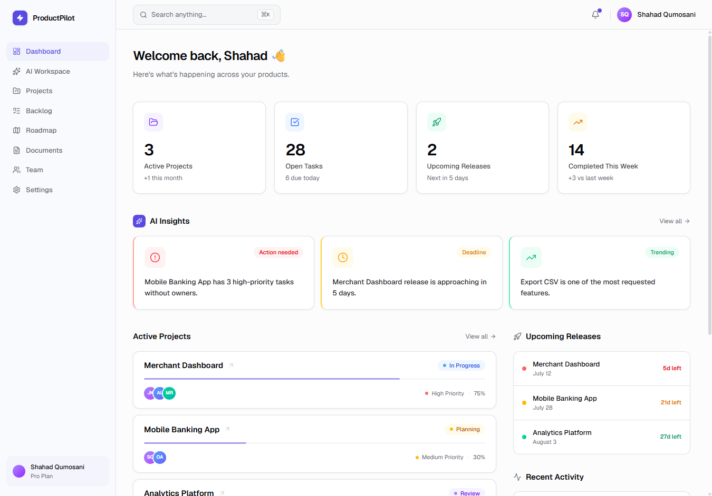
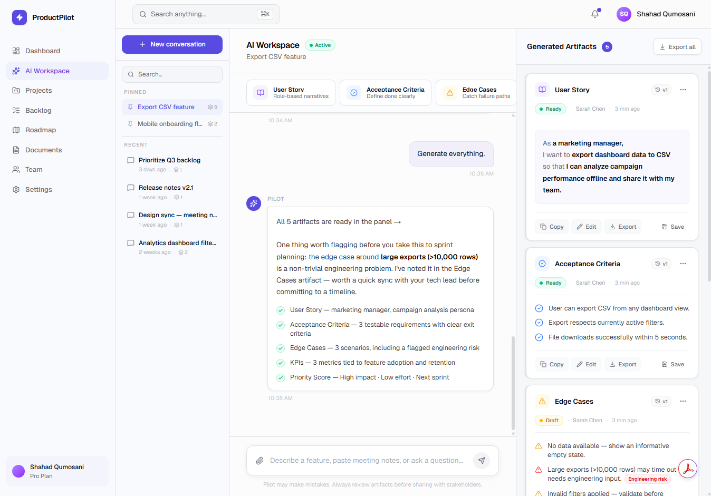
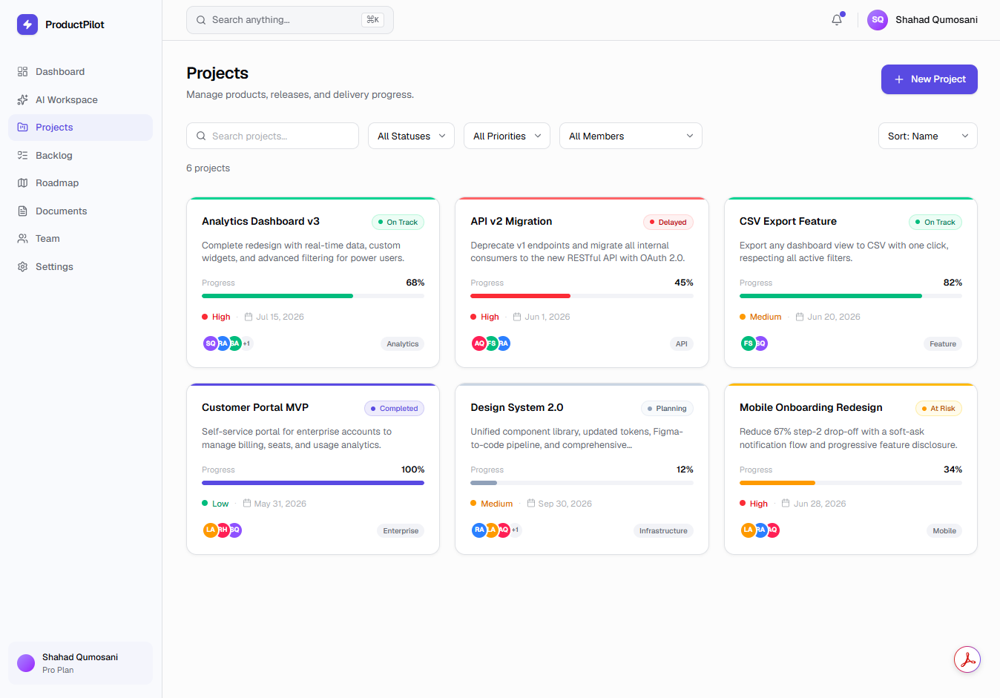
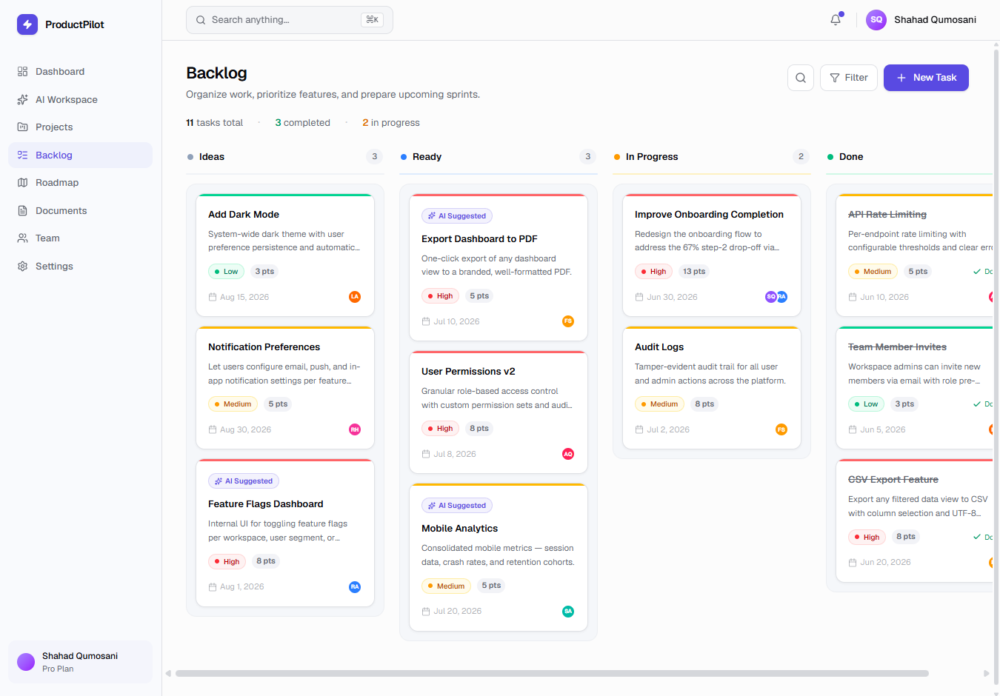
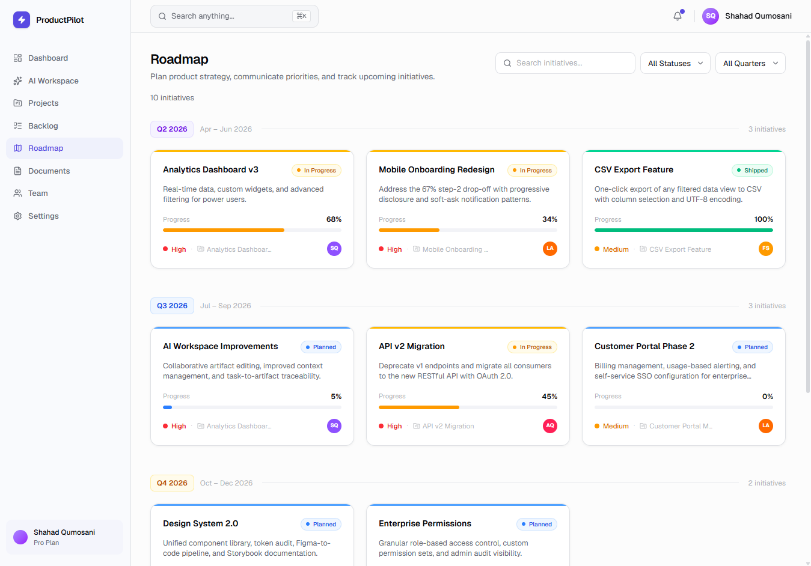
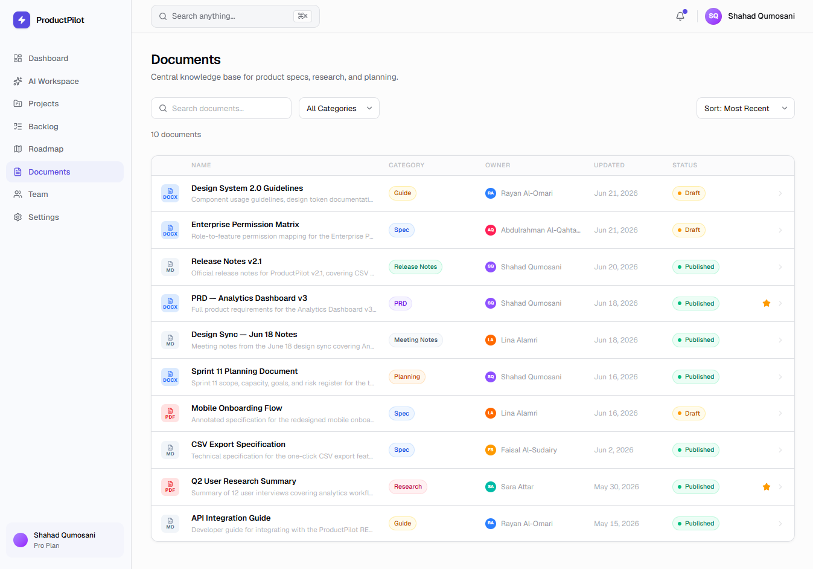
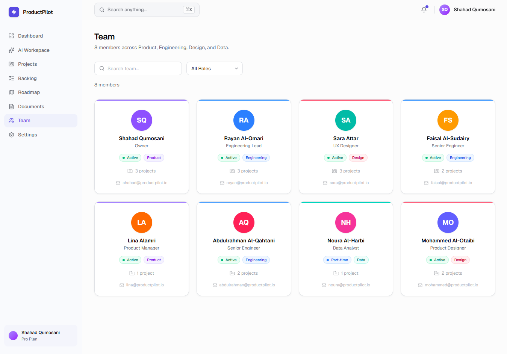
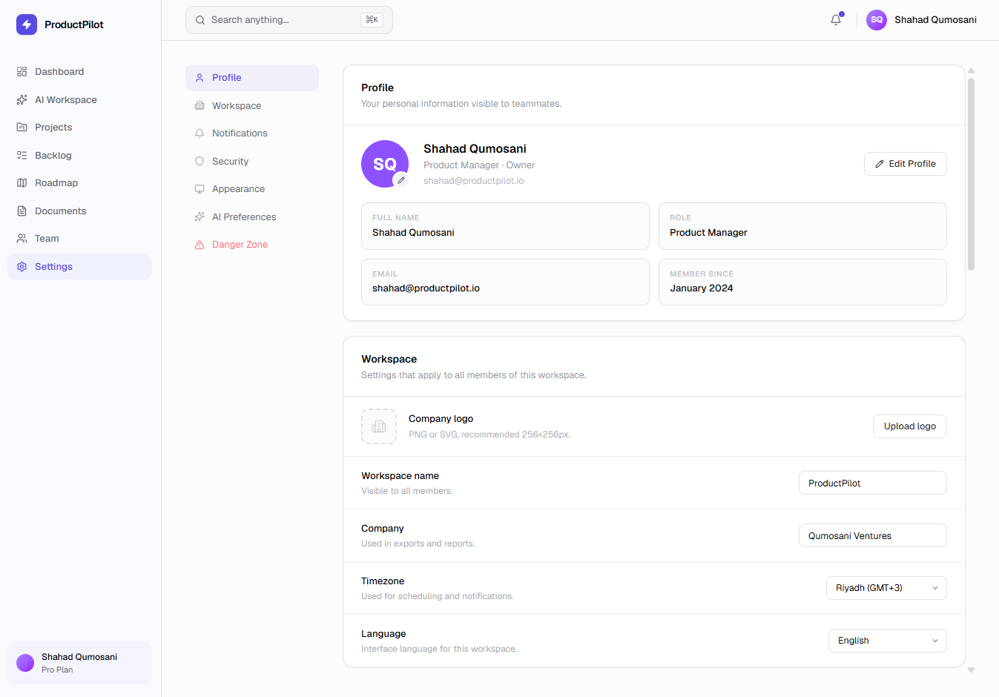

# ProductPilot

<div align="center">

**An AI-powered Product Management workspace for modern product teams.**

Plan roadmaps • Prioritize backlogs • Collaborate with your team • Generate AI-powered product artifacts

[Live Demo](https://productpilot-4a8vmzfq3-shosho-oaks-projects.vercel.app/dashboard) · [GitHub](https://github.com/shosho-oak/productpilot)

</div>

---

## Overview

ProductPilot is a modern Product Management workspace designed to bring the core product development workflow into one cohesive experience.

It combines project planning, backlog management, roadmap visualization, product documentation, team collaboration, and an AI-powered workspace in a single interface.

This project was designed and built as a portfolio project to demonstrate **Product Management thinking, UX/UI design, design systems, AI product design, and frontend implementation.**

---

## Features

### Dashboard
- Product health overview
- KPI and product metrics
- AI-generated insights
- Active projects
- Upcoming releases
- Recent documents

### AI Workspace
- Conversational AI assistant
- Context-aware product conversations
- AI-generated product artifacts
- Prompt history
- Artifact workspace

### Projects
- Project portfolio management
- Project progress tracking
- Team assignments
- Status management
- Project details

### Backlog
- Product backlog management
- Priority scoring
- Search and filtering
- Task details
- Product metadata

### Roadmap
- Quarter-based planning
- Initiative tracking
- Progress visualization
- Dependencies
- Risks
- AI recommendations

### Documents
- Central product knowledge base
- Multiple file types
- Search and categorization
- Document previews
- File downloads

### Team
- Team directory
- Member roles
- Workspace collaboration
- Team management

### Settings
- Profile management
- Workspace settings
- Notifications
- Security
- Appearance preferences
- AI preferences

---

# Screenshots

## Dashboard



## AI Workspace



## Projects



## Backlog



## Roadmap



## Documents



## Team



## Settings



---

# AI Features

ProductPilot integrates AI directly into product workflows rather than treating AI as a separate tool.

- AI Product Assistant
- Context-aware conversations
- Product artifact generation
- Roadmap recommendations
- Product insights
- AI Workspace
- Configurable AI preferences

---

# Design Approach

The product was designed around a few core principles:

**Clarity**  
Keep complex product information easy to scan and understand.

**Consistency**  
Use a shared component system, spacing, typography, and interaction patterns across the product.

**Action-oriented workflows**  
Surface the information and actions product teams need without unnecessary interface complexity.

**AI as a product capability**  
Integrate AI into existing product workflows where it can support decision-making and execution.

**Enterprise SaaS usability**  
Balance a modern visual language with the density and functionality expected from professional product management software.

---

# Tech Stack

### Frontend

- Next.js
- React
- TypeScript
- Tailwind CSS

### UI & Interaction

- shadcn/ui
- Framer Motion
- Lucide Icons

### Development & Deployment

- Git
- GitHub
- Vercel

---

# Project Structure

```text
product-pilot/
├── public/
├── screenshots/
├── src/
│   ├── app/
│   ├── components/
│   ├── config/
│   ├── hooks/
│   ├── lib/
│   ├── stores/
│   └── types/
├── .gitignore
├── package.json
├── README.md
└── tsconfig.json
```

---

# Running Locally

Clone the repository:

```bash
git clone https://github.com/shosho-oak/productpilot.git
```

Navigate to the project:

```bash
cd productpilot
```

Install dependencies:

```bash
npm install
```

Start the development server:

```bash
npm run dev
```

Open:

```text
http://localhost:3000
```

---

# What This Project Demonstrates

- Product Management
- UX/UI Design
- Information Architecture
- Design Systems
- AI Product Design
- Enterprise Dashboard Design
- Frontend Development
- Component Architecture
- Product Strategy & Prioritization

---

# Future Improvements

The current project focuses on the product experience and frontend implementation. Potential future iterations could include:

- Authentication
- Backend integration
- Database persistence
- Real AI API integration
- Real-time collaboration
- Persistent user preferences
- Notifications infrastructure
- Mobile optimization

---

# Author

**Shahad Qumosani**

Product Manager · Product Designer

[LinkedIn](https://www.linkedin.com/in/shahad-qumosani/)

[Portfolio](https://portfolio-self-chi-6id0zd2sjy.vercel.app/)

---

## License

This project was created for portfolio and educational purposes.